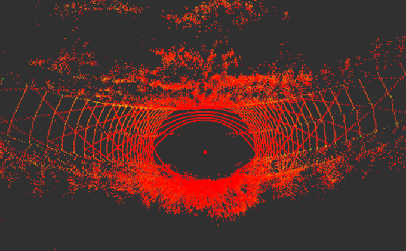
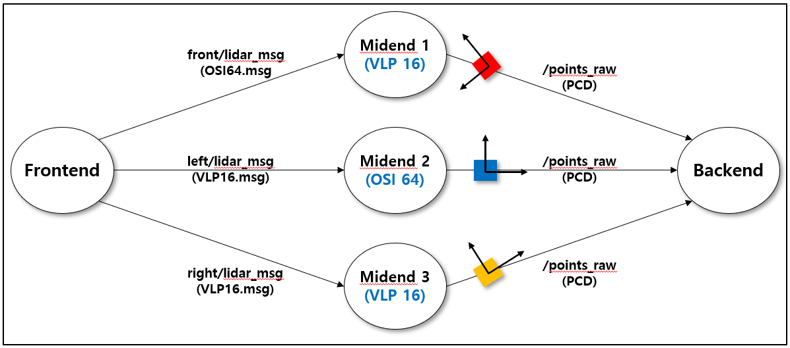

# Ichthus Lidar Driver
Ichthus Lidar Driver is a multi-lidar fusion driver designed for an autonomous vehicle named Ichthus, which was equipped with 3 lidars on the roof, i.e., Ouster-1-64 (front), Velodyne 16 (left), and Velodyne 16 (right). The driver receives point clouds from the three lidars and produces a merged cloud as output.


---
## Table of Contents

- [Overview](#overview)
- [Configuration](#configuration)
- [Build](#build)
- [Dependencies](#dependencies)
- [How to launch](#how-to-launch)

---

## Overview
* The driver is written as a ROS nodelet that includes three different types of ROS nodes. They are frontend, midend, and backend nodes, as shown in the following figure. Thanks to the nodelet design, all ROS messages exchanged between the nodes are zero-copied.
* The single frontend has two modes of operations. In socket mode, it receives lidar packes on the fly from UDP sockets connected to the lidars and publishes them to the midend nodes. In pcap play mode, it reads lidar packes from a pre-recorded pcap file which contains all packets issued from the lidars and publishes them to the midend nodes.
* Each midend node, created for each lidar, receives packets from the frontend until they form a full 360-degree rotation of the lidar, and publishes a point cloud to a designated backend node. In the midend, the point cloud is rendered in the coordinate of the lidar sensor itself. If you want to add other lidar models than the one used here, you simply need to add the packet parsing logic of the new lidar model into the midend node.
* Each backend node, created for a possible combination of the lidars, receives the point clouds from the associated midends and merges them in the coordinate of the vehicle itself. Then, it produces the merged cloud as output. 



---

## Configuration

### **Frontend**

|Syntax|Description|
-------|--------
|`lidar_num`|number of lidars used|
|`pcap_file`|pcap file used in pcap play mode|
|`pcap_wait_factor`|scale factor of timer wait, which emulates the interarrival times of lidar msgs in pcap play mode|
|`mode_*`|lidar model selection: 0 means VLP16 (Velodyne Puck 16 model), 1 means OSI64 (Ouster-1-64 model)|
|`ip_add_*`|ip address of each lidar|


* **Example: ichthus_frontend_default.yaml**

```yaml
###
### number of lidars used
###
lidar_num : 3

###
### pcap file used to replay
###
pcap_file : ""

###
### scale factor of timer wait, which emulates the interarrival times of lidar msgs
###
pcap_wait_factor : 0.6

###
### lidar model selection:
### 0 means VLP16 (Velodyne Puck 16 model)
### 1 means OSI64 (Ouster-1-64 model)
###
mode_front : 1
mode_left  : 0
mode_right : 0

###
### ip address of each lidar
###
ip_add_front : "192.168.1.3"
ip_add_left  : "192.168.1.202"
ip_add_right : "192.168.1.203"
```

### **Midend**

|Syntax|Description|
-------|--------
|`calibration_path`|calibration file|
|`mode`|VLP16: 0, OSI64: 1|
|`frame`|frame ID of output cloud|
|`pub_topic`|publishing topic name|
|`sub_topic`|subscribing topic name|
|`rate`|rate of publishing output messages|


* **Example: ichthus_midend_default.yaml**

```yaml
calibration_path : ""

## VLP16 : 0, OSI64 : 1 ##
mode : 1

frame : "velodyne"
pub_topic: "vlp1/points_raw"
sub_topic: "front/lidar_msg"
rate: 10 # Hz

```

### **Backend**
 
|Syntax|Description|
-------|--------
|`in_cloud#`|input cloud|
|`topic_name(in_cloud)`|topic name of input cloud|
|`pose_yaw`|yaw of lidar|
|`pose_pitch`|pitch of lidar|
|`pose_roll`|roll of lidar|
|`pose_x`|position x of lidar|
|`pose_y`|position y of lidar|
|`pose_z`|position z of lidar|
|`out_cloud`|output cloud|
|`topic_name(out_cloud)`|topic name of output cloud|
|`frame_id`|frame ID of output cloud|
|`rate`|rate of publishing output messages|


* **Example: ichthus_backend_default.yaml**

```yaml
#input topic info, (yaw,pitch,roll in degree/ x,y,z in meter)
in_cloud1: # Front
  topic_name: /vlp1/points_raw
  pose_yaw: 0
  pose_pitch: 0
  pose_roll: 0
  pose_x: 0
  pose_y: 0
  pose_z: 0.0045

in_cloud2: # Left
  topic_name: /vlp2/points_raw
  pose_yaw: 90
  pose_pitch: 15.2
  pose_roll: 0
  pose_x: 0
  pose_y: 0.61772
  pose_z: -0.20120

in_cloud3: # Right
  topic_name: /vlp3/points_raw
  pose_yaw: -90
  pose_pitch: 15.2
  pose_roll: 0
  pose_x: 0
  pose_y: -0.61772
  pose_z: -0.20120

out_cloud:
  topic_name: points_raw
  frame_id: velodyne
  rate: 10 # Hz
```

---

## Build
As usual with Colcon,
```
cd colcon_ws/src
git clone https://github.com/ICHTHUS-SSU/ichthus_lidar_driver.git
cd ..
colcon build --packages-select ichthus_lidar_driver --cmake-args -DCMAKE_BUILD_TYPE=Release
```
Otherwise,
```
cd catkin_ws/src
git clone https://github.com/ICHTHUS-SSU/ichthus_lidar_driver.git
cd ..
catkin_make
```

---

## Dependencies
* `ROS`
* `Boost`

---

## How to launch
1. Modify the settings files of frontend, midend, and backend nodes if needed. Do not forget to define a midend node for every lidar you use.
2. Run the ichthus lidar driver as follows.

`roslaunch ichthus_lidar_driver ichthus_lidar_driver.launch`

---
